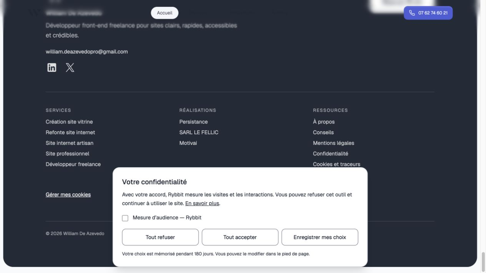
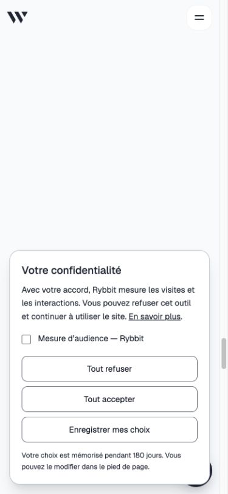

# Confidentialité : préparation du déploiement

Cette modification introduit un choix préalable pour Rybbit, supprime la file d'événements en sessionStorage, recharge après retrait et mémorise acceptation comme refus pendant 180 jours. Les liens du pied de page permettent de retrouver l'information et de modifier le choix. Cal.com est chargé uniquement au clic sur une réservation. Les URL des événements manuels excluent paramètres et fragments ; les captures automatiques Rybbit restent pilotées par son serveur.

## Bloquants avant fusion vers 2026

`2026` déclenche le déploiement. La PR doit rester en brouillon jusqu'à résolution des éléments suivants. Aucun de ces changements de production n'est effectué par la PR.

- **Désactiver Auto-inject script dans Zaraz** avant de déployer le nouveau code. La configuration publiée actuelle injecte Zaraz indépendamment du code du site : ajouter un panneau local ne peut pas bloquer cette injection. Le chargement manuel utilise le chemin officiel `/cdn-cgi/zaraz/i.js`.
- Décider si Google Analytics 4 et Google Ads sont nécessaires. Par défaut, le nouveau code **ne charge pas manuellement Zaraz** et ne présente pas la catégorie publicitaire, car les variables de finalité sont absentes. Si Rybbit seul est conservé, désactiver les deux outils Google dans Cloudflare.
- Si les outils Google sont conservés : activer la gestion de consentement Zaraz, créer des finalités distinctes audience/publicité, associer GA4 et Ads aux finalités correspondantes et refuser par défaut. Renseigner leurs vrais identifiants dans `PUBLIC_ZARAZ_AUDIENCE_PURPOSE` et `PUBLIC_ZARAZ_MARKETING_PURPOSE` au build. L'API de consentement doit bloquer chaque outil jusqu'au choix correspondant. Empêcher une seconde interface de choix Zaraz de contredire celle du site. Examiner/supprimer les anciens cookies de mesure après retrait si les outils en déposent.
- **Confirmer Rybbit** : hébergeur, pays, IP brutes/salage, durée de conservation et purge. Compléter l'information publique avec ces valeurs réelles. Désactiver les captures inutiles (copies, interactions de formulaires, paramètres d'URL) ; ne conserver que les paramètres nécessaires. Le consentement ne remplace pas la minimisation.
- **Confirmer les durées email/rendez-vous** et les garanties applicables aux transferts chez les prestataires. Le texte amélioré décrit les finalités et critères généraux mais ces détails restent à valider ; il ne prouve pas qu'une politique de suppression est appliquée côté Gmail ou Cal.com.
- Examiner les cookies et requêtes Cal.com : l'ouverture d'un calendrier demandé n'autorise pas ses traceurs publicitaires ou d'audience facultatifs. Si présents, les empêcher ou remplacer l'intégration par un lien externe informé.

## Vérification

- `bun test tests/privacy-consent.test.ts` : choix absent/invalide/expiré, refus, acceptation audience, retrait, absence de mesure Rybbit pour publicité seule, suppression des paramètres d'URL.
- `bun run lint`, `bun run build`, `git diff --check`.
- Navigateur local : panneau visible, refus puis navigation Astro, absence des scripts Rybbit/Zaraz/Cal, réouverture par le pied de page.
- Avant publication : répéter sur la prévisualisation Cloudflare avec un navigateur neuf. Tester audience seule, publicité seule, tout accepter, tout refuser et retrait ; vérifier requêtes, stockages, finalités et événements serveur Zaraz. Les tests locaux utilisent des doubles pour les scripts tiers et ne prouvent pas l'exécution de la configuration Cloudflare réelle.
- Aucun rendez-vous, email ou conversion de test réelle envoyé.

## Sources

- [Cloudflare — Chargement manuel](https://developers.cloudflare.com/zaraz/advanced/load-zaraz-manually/)
- [Cloudflare — API de consentement](https://developers.cloudflare.com/zaraz/consent-management/api/)
- [Cloudflare — Consent Mode Google](https://developers.cloudflare.com/zaraz/advanced/google-consent-mode/)
- [CNIL — Traceurs et exemptions](https://www.cnil.fr/fr/cookies-solutions-pour-les-outils-de-mesure-daudience)
- [CNIL — Durées de conservation](https://www.cnil.fr/fr/passer-laction/les-durees-de-conservation-des-donnees)

L'[audit initial](audit-confidentialite-2026-09-30.md) décrit les observations de production avant ces modifications.

## Captures locales

