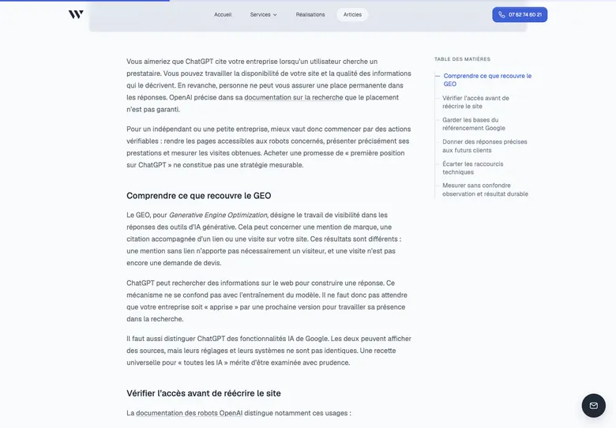

# Vérification de la série éditoriale

## Contrôles locaux

- Installation : `bun install --frozen-lockfile`, sans changement de dépendances.
- `npm run build` : succès, 28 pages construites au total. Astro 7 émet un avertissement de dépréciation pour `markdown.rehypePlugins` ; le hook reste fonctionnel et aucun changement de dépendance n'a été ajouté pour cette série. Migrer vers son API `unified` lors de la prochaine maintenance de la chaîne Markdown.
- Tableaux : conteneurs nommés générés au build, focalisables par Tab avec focus visible ; sur mobile Chromium, deux pressions Flèche droite font passer le défilement de 0 à 74 px. Safari n'a pas été exécuté.
- `node scripts/check-editorial.mjs` : dix nouveaux articles présents, listing, sitemap, canonical, BlogPosting/BreadcrumbList, couverture Open Graph, portrait Person indépendant et liens locaux vérifiés.
- `npm run lint` : succès.
- Formatage des nouveaux Markdown/JSON et du test par oxfmt ; `git diff --check` sans erreur.
- Navigation réelle avec agent-browser sur le build statique, requêtes HTTPS externes bloquées pour éviter les événements de mesure en production.
- Dix routes × trois tailles : 390×844, 768×1024 et 1440×1000. Aucun débordement horizontal de page, aucune image d'article cassée, un seul H1, aucune ancre interne manquante. Résultats détaillés : [responsive.json](responsive.json).
- Recherche « ChatGPT » dans le listing : un résultat pertinent ; clic sur son titre et navigation Astro vers l'article réussis. Un premier clic automatisé sur la grande carte a été perturbé par le scroll/entête fixe : le test a été refait sur le titre visible, sans clic JavaScript forcé.
- Sommaire GEO : clic vers « Vérifier l’accès avant de réécrire le site », fragment correct et titre positionné sous l'entête.
- Axe sur le corps de l'article GEO : aucune violation automatique, une vérification de contraste indéterminée à cause de l'entête superposé lors du défilement. Ceci n'est pas un audit de conformité du site.

## Captures

### `/articles/referencement-chatgpt/` — haut de page, titre et début de couverture, ordinateur

### `/articles/referencement-chatgpt/` — début du texte et sommaire latéral, ordinateur

### `/articles/prix-site-vitrine/` — haut de page, titre et couverture, mobile

## Limites

Les tests sont locaux ; le déploiement public dépend de la validation et fusion de la PR. Aucune prise de contact réelle ni réservation créée. Les sources consultées et les limites de collecte figurent dans les notes de recherche voisines. Les captures des réalisations sont les captures existantes du dépôt, pas des relevés actualisés des sites clients.
