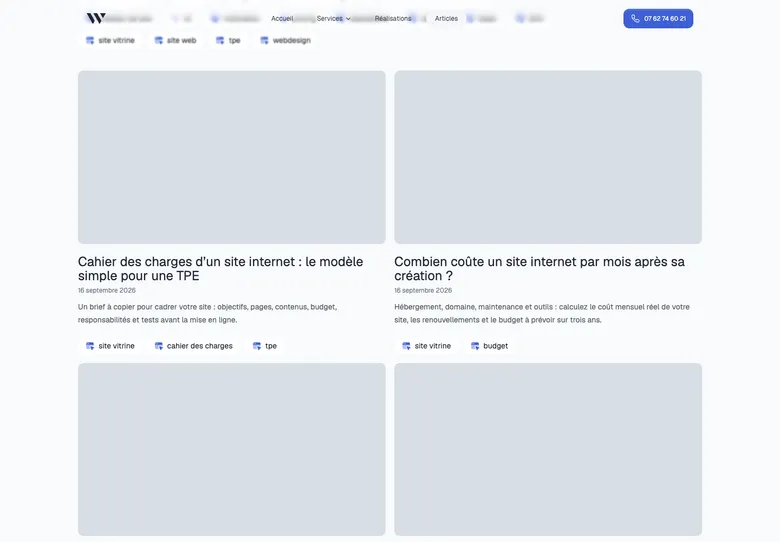

# Refonte visuelle des articles — 22 septembre 2026

Couvertures et composants repris pour suivre le design du site (Geist, palette bleue, cartes arrondies) plutôt que l’ancien style beige généré avec Pillow.

- Dix couvertures redessinées en HTML (`scripts/editorial/covers.html`) et rendues en WebP 1600×900 par `render-covers.mjs` ; mêmes chemins, textes alternatifs conservés (celui de l’accessibilité est précisé).
- Bloc identité/site, encadré Persistance et checklist : cartes blanches bordées, pastilles numérotées, chevron à la place du triangle natif, barre de progression pour la checklist.
- Tableaux dans un cadre arrondi, en-têtes discrets, montants alignés à droite et ligne de total mise en avant ; listes à cocher Markdown en carte, cases masquées aux lecteurs d’écran car non interactives.
- `bun run build` (28 pages), `node scripts/check-editorial.mjs`, `bun run lint` et `git diff --check` réussis.
- Contrôle visuel à 1440 et 390 px : pas de débordement horizontal. Checklist : 3/7 cochées, remise à zéro active.
- axe 4 sur les composants modifiés, les tableaux et la liste à cocher : aucune violation. Les échecs de contraste restants viennent du gabarit existant (lien « Tous les articles », date, sommaire en `gray-500` sur le fond de page) et ne font pas partie de cette reprise.

Captures mises à jour dans ce dossier, avec en plus `listing-desktop.webp` :

